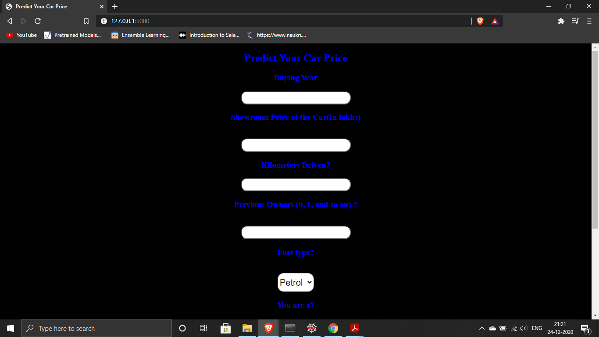
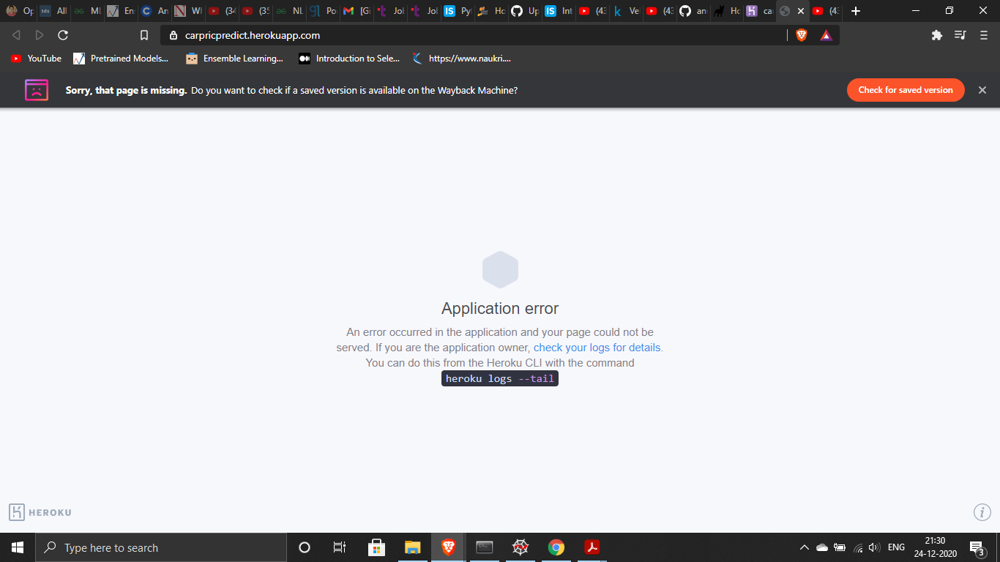

# Car Price Prediction Application

## Table of contents
* [Introduction](#introduction)
* [Preview](#preview)
* [Technologies](#technologies)
* [Dataset](#dataset)

## Introduction
The application is a web application which is created using HTML, CSS for the Front-End of the application. We created a Random Forest Regression model which we use to predict the selling prices of a used car. .........

## Preview

## Technologies
* Python 
* HTML 
* CSS
* React JS
* Flask
* Heroku
* Jupyter Notebook

## Dataset 
We used an open-source Kaggle dataset by CarDekho.com. The link for the dataset is below. The dataset is a clean dataset with no missing values.
https://www.kaggle.com/nehalbirla/vehicle-dataset-from-cardekho

If you want to view the deployed model, click on the following link:
Deployed at: https://carpricpredict.herokuapp.com/

----- Important Note -----
* If you encounter this webapp as shown in the picture given below, it is occuring just because free dynos for this particular month provided by Heroku have been completely used. You can access the webpage on 1st of the next month.
* Sorry for the inconvenience.

